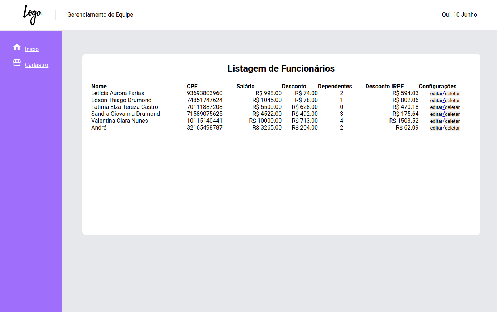
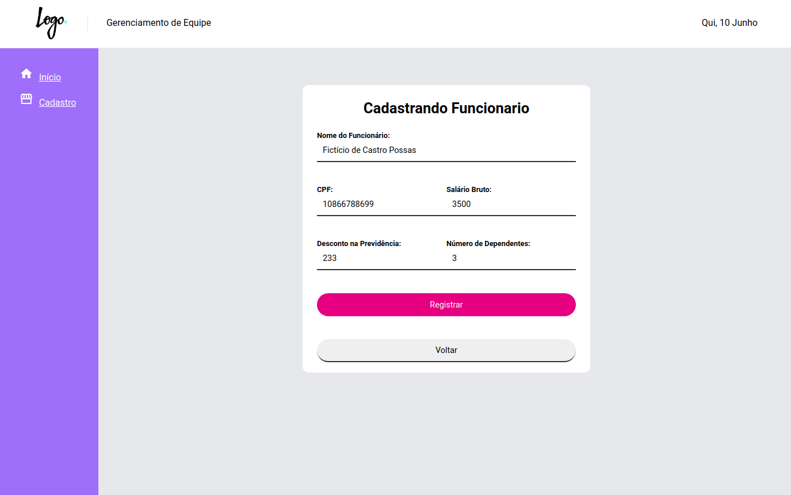
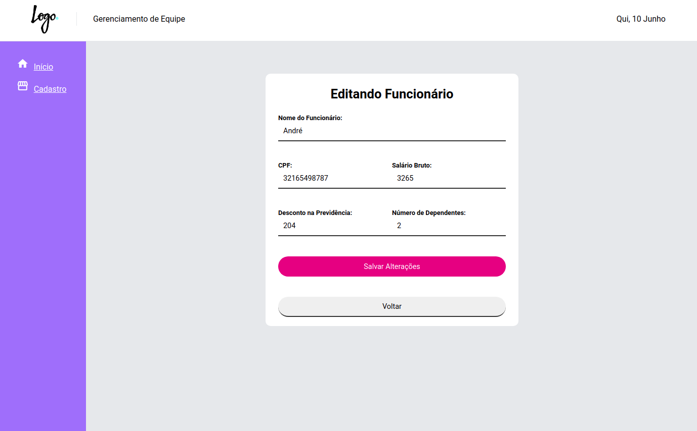
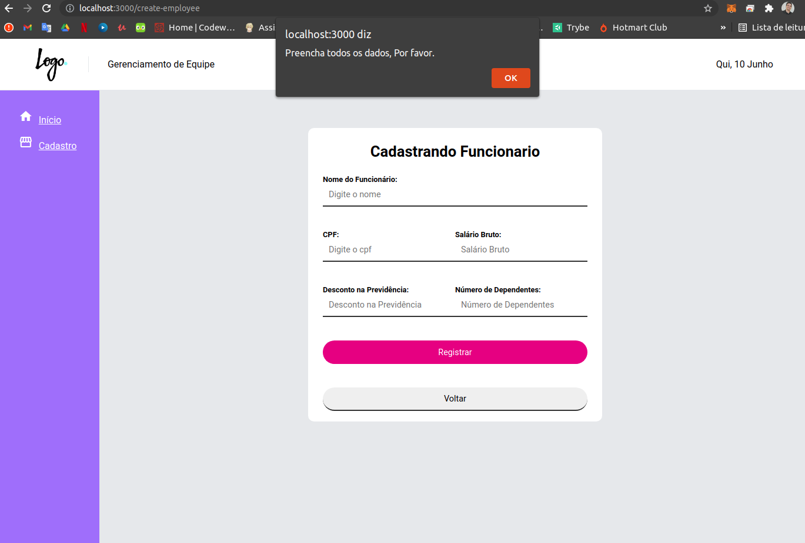

<h1 align="center">Staff Management</h1>
<p align="center">Projeto que cadastra e controla taxa de IRPF de funcionarios.</p>


[](https://www.linkedin.com/in/andrepossas/)


Tabela de conteúdos
=================
<!--ts-->
   * [Features](#Features)
      * [Obrigatorios](#Obrigatorios)	
      * [Diferenciais](#Diferenciais)
   * [ScreenShots](#ScreenShots)
   * [Pré-requisitos](#Pré-requisitos)		
   * [Clone o projeto](#Clone o projeto)
   * [Rodando o Back End](#Rodando o Back End)
   * [Rodando o Front End](#Rodando o Front End)
   * [Tecnologias](#tecnologias)
   * [Autor](#Autor)
<!--te-->

<h2 align="center"> 
	🚧  React Select 🚀 Em construção...  🚧
</h2>

## Features
### Obrigatorios.

- [x] Código Fonte Público
- [x] React Utilizado
- [ ] Testes Unitários
- [x] Calculo de IRPF
- [x] Cadastro de Funcionário
- [x] CRUD Funcionário
- [ ] Utilização de REDUX
- [x] Readme
- [x] Rotas

### Diferenciais.
- [x] TypeScript
- [x] Projeto Funcional

### Não Avaliados.
- [ ] Cadastro de usuário
- [x] Header
- [ ] Footer
- [ ] REDUX SAGA 
- [ ] trocar logo

### Urgencia.
- [ ] Refatoração de Validação de Cadastro e editar Funcionário
- [ ] Estilização SASS moderno
- [ ] Tela de Login
- [ ] JWT
- [ ] Formatação de CPF

# ScreenShots

<h1 align="left">
  
</h1>
<h1 align="right">
  
</h1>
<h1 align="left">
  
</h1>
<h1 align="right">
  
</h1>

### Pré-requisitos

Antes de começar, você vai precisar ter instalado em sua máquina as seguintes ferramentas:
[Git](https://git-scm.com), [Node.js](https://nodejs.org/en/). 
Além disto é bom ter um editor para trabalhar com o código como [VSCode](https://code.visualstudio.com/)

### Clone o projeto:
Abra o terminal de comandos e digite:
```bash
git clone git@github.com:dekopossas/staff-management.git
```
ou acesse esse [link](git@github.com:dekopossas/staff-management.git) e baixe o zip.

### 🎲 Rodando o Back End (servidor)
O foco do projeto era demonstrar minhas habilidades com frontend, portanto utilizei o backend que considero o mais simples possível e fácil de fazer, Json Server.
Na pasta do projeto, abra seu terminal e siga o passo a passo:

```bash
# Acesse a pasta do projeto backend
$ cd backend

# Instale as dependências
$ npm install

# Inicíe o Backend com o comando:
$ npm start
```
### O servidor inciará na porta:3001 -
OBS, adicionei 750 milissegundos de delay manualmente para as requisições tentando simular uma requisição realista.

### 🎲 Rodando o Front End (site)
Em um novo terminal na pasta local do projeto siga este passo a passo:

```bash
# Acesse a pasta do projeto frontend
$ cd frontend

# Instale as dependências
$ npm install

# Inicíe o Frontend com o comando:
$ npm start
```
Aguarde até abrir o navegador na porta 3000

Caso esteje usando o pacote yarn, alem do comando ser diferente, deverá abrir o navegador manualmente na porta 3000
recomento seguir a [documentação](https://classic.yarnpkg.com/en/)


### 🛠 Tecnologias

As seguintes ferramentas foram usadas na construção do projeto:

- [Json Server](https://github.com/typicode/json-server) Backend
- [React](https://pt-br.reactjs.org/) Framework
- [TypeScript](https://www.typescriptlang.org/) Linguagem
- [MATERIAL-UI](https://material-ui.com/pt/) UI expirience
- [axios](https://github.com/axios/axios) Promise based HTTP client
- [date-fns](https://date-fns.org/)time library
- [react hook form](https://react-hook-form.com/) forms library
- [SASS](https://sass-lang.com/) CSS

### Autor
---

Feito com ❤️ por André Possas 👋🏽 Entre em contato!


[](andrepossaster@gmail.com)
[](https://www.linkedin.com/in/andrepossas/)
